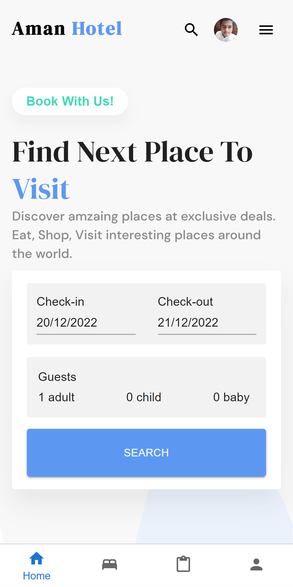
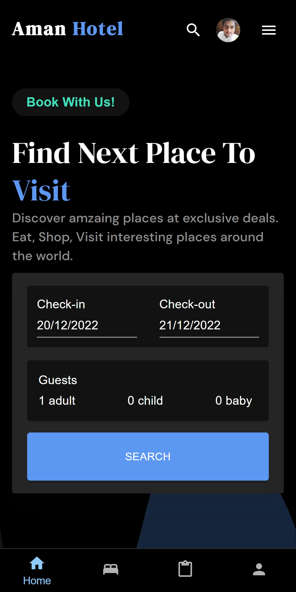
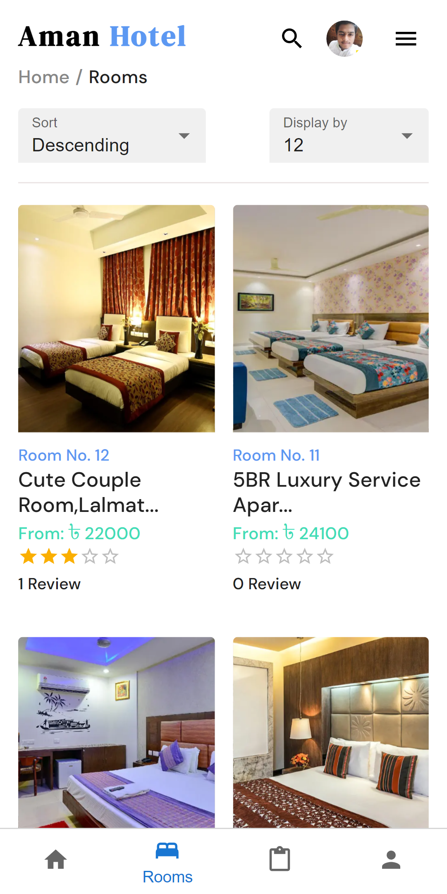
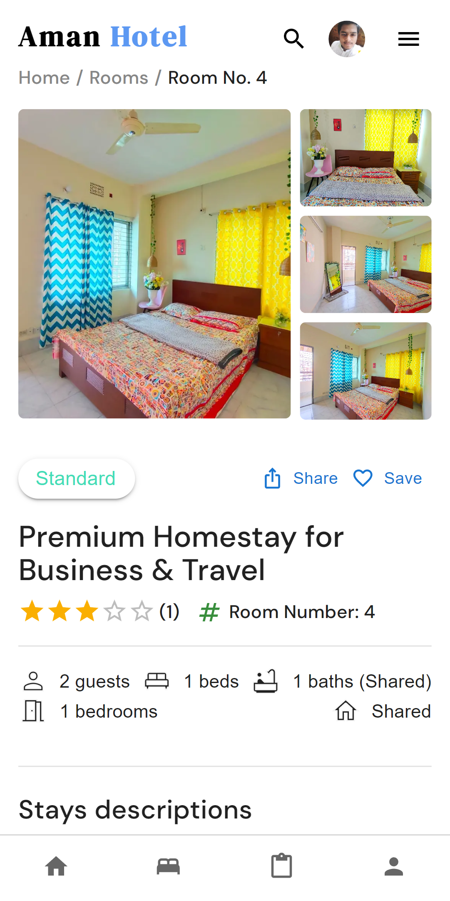
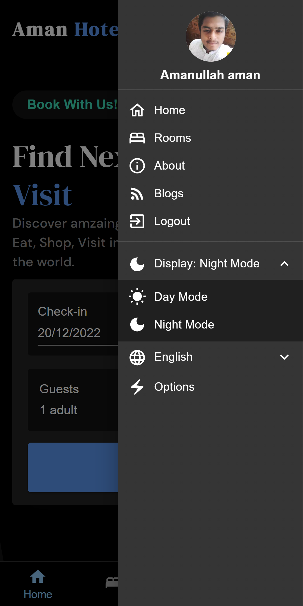

# `Aman-Hotel` Full Stack Hotel-Booking App (pwa)

## Features
* Select Rooms
   - Select check-in and check-out dates from the calendar
   - select Guests = adult | children | babies
* Rooms Filter by
   - Guests number
   - check-in - check-out date
   - Facilities of Rooms
   - Conditions of rooms
   - Room Type
   - Price range of rooms
* Sorting Rooms 
   - Descending by roomNumber
   - Ascending by roomNumber
   - High to Low Price 
   - Low to High Price
   - Popular by countReviews
   - High rating
* Room display count per page 
   - 12 room default show
   - display 15 rooms
   - display 18 rooms
   - display 24 rooms
* Dynamic pagination to calculate all rooms
- Room Search
    - Search Rooms by room number
    - previous search history shows
    - single / all search history delete

- Single Rooms page
  - Rooms
    - show all image
    - show Facilities,Rules,title,descriptions
    - show Special Note
  - Reviews (Real Time,like google play store review)
    - show all Reviews with rating
    - Give a Review about the room with Rating Star (only loggedIn Users)
    - show review created and updated time  
    - The overall rating show calculate by all reviews
    - give a like in the review (toggle system)
    - Edit review and rating (LoggedInUser)
    - delete review (admin or LoggedInUser)
  - Booking Form
    - date change
    - guess number change
    - total price is shown by calculating the per night, service charge and discount(10%)
  - confirm Booking form (Different Page)
    - show booking all info and give extra information (like payment getway and user info,etc.)

* user account (private)
  - Account Dashboard (show all account shortcut info and upcoming bookings)
  - account profile
    - update profile photo
    - update account others info
  - account booking
    - show all previous and upcoming bookings
    - Booking processing show through the stepper and status bar
    - booking process step by Requested, Accepted, Confirmed, Reviewed, and Completed
    - show booking all info like Details, Billing Address, Payment Method, Price Details
  - account reviews
    - show all reviews given by yourself
    - also customize the review from here
  - account liked
    - show all liked given by yourself
    - also customize the Like form here
  - account favorite -> show all favorite list and delete
 
 * Dark and light mode option
- Progressive web app
    - Show app install Banner first time
    - after not installing this app then one day later it also shows again

* Mobile device extra part
  - bottom navigation
  - search Different Page
  - account list different page (private)
  - header list drawer
  - room filter Different Page
- Responsive
  - Responsive on all device like desktop,laptop, tab and Mobile

## Live Project Demo
https://aman-hotel.vercel.app/

## Technologies Used
### Frontend
* [NextJs](https://nextjs.org/) 
* [TypeScript](https://www.typescriptlang.org/) 
* [Redux Toolkit and RTK Query](https://redux-toolkit.js.org/) 
* [Sass](https://sass-lang.com/) 
* [axios](https://axios-http.com/) 
* [Material-UI](https://mui.com/) 
* etc .

### Backend
* [Nodejs](https://nodejs.org/en/)
* [ExpressJs](https://expressjs.com/)
* [MongoDb](https://www.mongodb.com/)
* [Mongoose](https://mongoosejs.com/)
* [Json Web Token](https://jwt.io/)
* [momentjs](https://momentjs.com/)
* etc.

## License
[MIT](LICENSE) © Amanullah Nirob

#### Mobile App Screenshots

<table>
  <tr>
    <td>Home Page Light </td>
     <td>Home Page Dark</td>
     <td>Room Page</td>
     <td>single Room Light</td>
     <td>Header Drawer</td>
  </tr>
  <tr>
    <td></td>
    <td></td>
    <td></td>
    <!-- <td></td>
    <td></td> -->
  </tr>
 </table>
 
### If you liked this app, give it a star 🌟